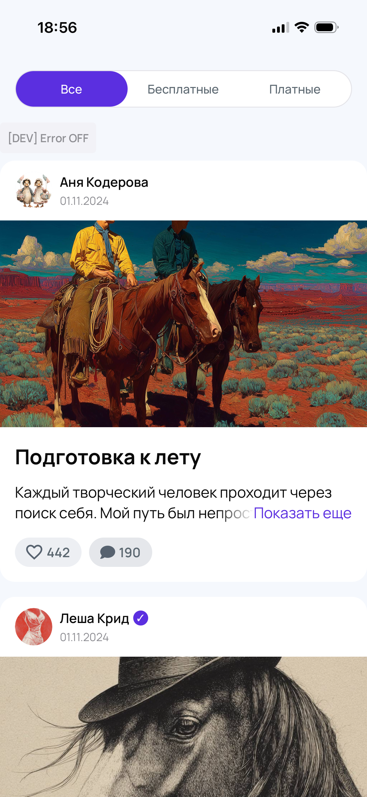
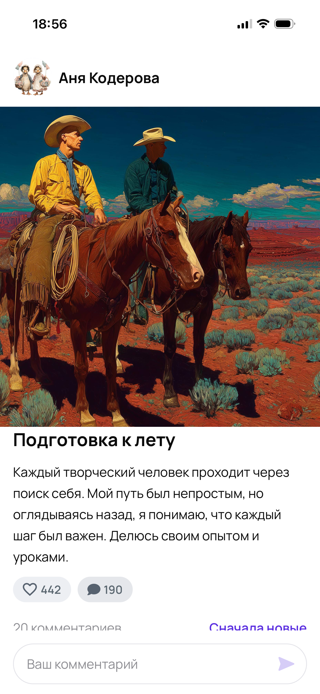
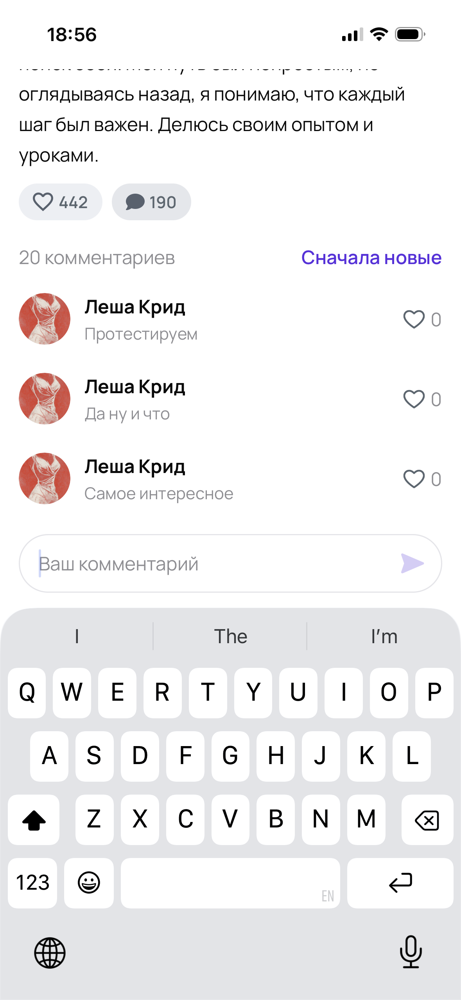

# Mecenate Mobile

Мобильное приложение для платформы Mecenate на **React Native + Expo**: лента постов от авторов с поддержкой платного контента, детальная страница поста, комментарии с real-time обновлениями по WebSocket, оптимистичные лайки с Reanimated-анимацией и haptic feedback.

## Скриншоты

<p align="center">
  
  
  
</p>

## Стек

- React Native 0.81 + Expo SDK 54
- TypeScript (strict)
- expo-router (typed routes)
- @tanstack/react-query — курсорная пагинация, оптимистичные мутации
- react-native-reanimated 4 + react-native-worklets
- expo-haptics, expo-image, expo-linear-gradient, expo-secure-store
- react-native-svg + svg-transformer

## Что нужно для запуска

- Node **20+** и npm **10+**
- Один из вариантов окружения:
  - iOS: установленный **Xcode** и iOS Simulator
  - Android: **Android Studio** + emulator с API 33+
  - Или физическое устройство с приложением **Expo Go** (iOS / Android)

## Установка и запуск в Expo

```bash
# 1. Клонировать репозиторий
git clone https://github.com/Kalmbik61/test-RN.git
cd test-RN

# 2. Установить зависимости
npm install

# 3. Запустить Metro / Expo dev-server
npx expo start
```

После запуска в терминале появится QR-код и меню Expo Dev Tools. Далее:

- **`i`** — открыть в iOS Simulator
- **`a`** — открыть в Android emulator
- **QR-код** — отсканировать камерой (iOS) или в Expo Go (Android), чтобы запустить на физическом устройстве

> Если экспо зависает или кеш побит: `npx expo start -c` (clear cache).

## Полезные команды

```bash
npm test            # Jest — юнит-тесты (api http, useFeed, Likes)
npm run typecheck   # tsc --noEmit
npm run lint        # ESLint (max-warnings=0)
```

## Что реализовано

**Лента (`app/index.tsx`)**

- Список постов: аватар, имя автора, превью текста (с fade + «Показать еще» inline), обложка, счётчики лайков и комментариев.
- Курсорная пагинация с подгрузкой при скролле (`onEndReached` + `useInfiniteQuery`).
- Pull-to-refresh с индикатором (`isRefetching`).
- Таб-фильтр **Все / Бесплатные / Платные**.
- Закрытый пост (`tier: "paid"`) — blur-обложка + заглушка с кнопкой «Отправить донат». Переход в деталку для paid-постов заблокирован.
- Ошибка API → `ErrorState` с «Не удалось загрузить публикации» + «Повторить».

**Детальный экран (`app/post/[id].tsx`)**

- Шапка с аватаром и именем автора (compact-вариант), обложка (высота 393), заголовок, полный текст.
- Кнопка лайка: `react-native-reanimated` — bounce-анимация иконки + анимация счётчика при изменении, `expo-haptics` на тап.
- Список комментариев с Lazy Load по скроллу контейнера (общий `useComments`-кеш через react-query).
- Шапка списка комментариев: общее количество с сервера (`post.commentsCount`) + переключатель сортировки «Сначала новые / Сначала старые».
- Поле ввода в pill-стиле с иконкой send внутри.
- Real-time: `like_updated` и `comment_added` обновляют кеш через WebSocket (`src/features/_app/useWsCacheSync.ts`).
- Оптимистичный add-comment: мгновенное отображение как «Вы», без визуального мигания от WS-эхо.

## Структура проекта

```
app/                    # expo-router screens
  _layout.tsx           # QueryClient + AuthProvider + WsBridge + Fonts
  index.tsx             # Feed
  post/[id].tsx         # Post Detail + SafeArea
src/
  api/                  # http, posts, comments, ws, types
  features/
    feed/               # useFeed, FeedTabs, PostCard, FeedSkeleton
    post/               # usePost, useToggleLike, PostHeader, PostSkeleton
    comments/           # useComments, useAddComment, CommentsList, CommentInput, pendingOwnComments
    _app/               # WsBridge, useWsLifecycle, useWsCacheSync
  ui/                   # Button, Tabs, Likes, Input, Comment, CommentsBadge, EmptyState, ErrorState, Loader, Skeleton, icons
  store/                # AuthContext (UUID + SecureStore)
  theme/                # tokens, typography
  utils/                # uuid, formatDate, queryKeys
```

## API

Приложение работает с публичным тестовым API:

- REST: `https://k8s.mectest.ru/test-app` (OpenAPI `/openapi.json`)
- WebSocket: `wss://k8s.mectest.ru/test-app/ws`

Авторизация — Bearer с клиентским UUID (генерится один раз, хранится в `expo-secure-store`, автоматически регенерируется при `401`).
